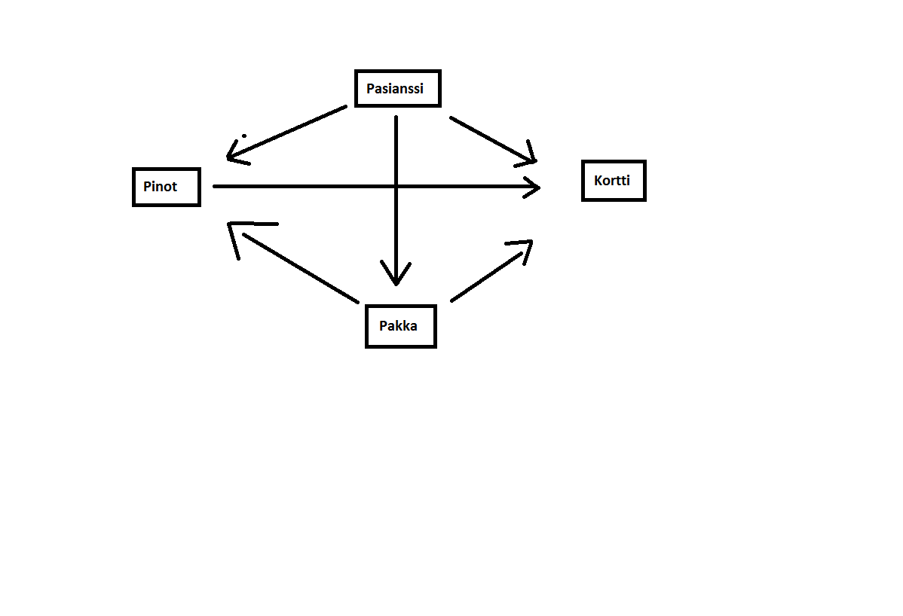

###Aihem‰‰rittely

Aihe: Pasianssi / Spiderpasianssi, korttipeli jossa j‰rjestell‰‰n kortteja kunnes pystyt‰‰n siirt‰m‰‰n kortit pois peliauleelta.

K‰ytt‰j‰t: Pelaaja

Pelaajan toiminnut:

-Pelin aloittaminen
	-Mahdollisesti pelin valinta

-Kortin siirt‰minen
	-K‰dest‰ peliin
	-Pinosta toiseen pinoon
	-Pinosta yl‰pinoihin

-High scorejen tarkistaminen

###Kuvaus
Ohjelma tulee toteuttamaan korttipelin, perinteisen tai spiderpasianssin, ehk‰ molemmat jos aika riitt‰‰. Mik‰li tulee molemmat niin alussa valitaan kumpi.
K‰yttˆliittym‰ tulee tummentamaan valitun kortin ja sen j‰lkeen k‰ytt‰j‰ voi yritt‰‰ siirt‰‰ korttia klickaamalla toista sijaintia.
Jos siirto on sallittu kortti siirtyy, muuten maalaus kortista katoaa sek‰ siirrot kasvat yhdell‰.

1. Korttien luominen tekstik‰yttˆliittym‰‰n
2. Korttien jakaminen
3. Osan korttien piilottaminen
4. Kortin siirt‰minen
5. Korttien siirt‰minen pois pelialueelta
6. Siirtojen laskeminen

