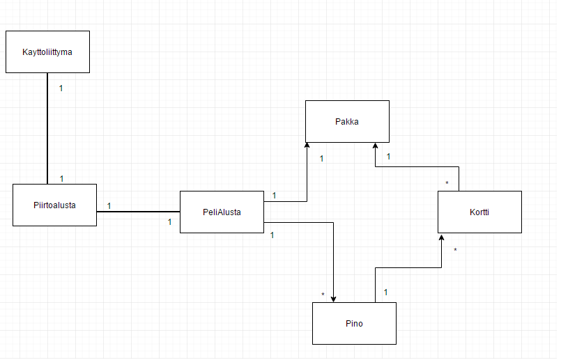
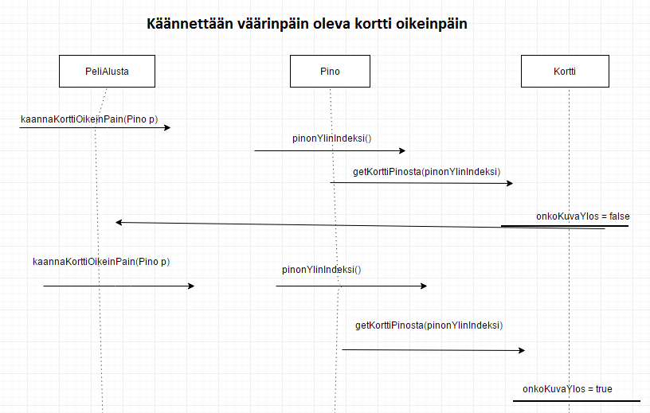
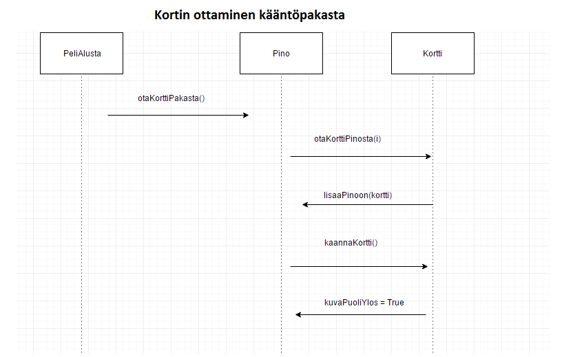

###Aihem‰‰rittely

Aihe: Pasianssi, korttipeli jossa j‰rjestell‰‰n kortteja kunnes pystyt‰‰n siirt‰m‰‰n kortit yl‰pinoihin jolloin peli p‰‰ttyy.

K‰ytt‰j‰t: Pelaaja

Pelaajan toiminnut:

-Pelin aloittaminen
	

-Kortin siirt‰minen
	-K‰dest‰ peliin
	-Pinosta toiseen pinoon
	-Pinosta yl‰pinoihin
	-Pakasta peliin

-High scorejen tarkistaminen

###Kuvaus
Ohjelma tulee toteuttamaan korttipelin, perinteisen pasianssin.
K‰yttˆliittym‰ tulee tummentamaan valitun kortin ja sen j‰lkeen k‰ytt‰j‰ voi yritt‰‰ siirt‰‰ korttia klikkaamalla toista sijaintia.
Jos siirto on sallittu kortti siirtyy, muuten maalaus kortista katoaa sek‰ siirrot kasvat yhdell‰.
Peli p‰‰ttyy kun kaikki kortit ovan siirretty ylˆs pinoihin, jotka menev‰t maittain ‰ss‰st‰ kuninkaaseen.

1. Korttien luominen tekstik‰yttˆliittym‰‰n
2. Korttien jakaminen
3. Osan korttien piilottaminen
4. Kortin siirt‰minen
5. Korttien siirt‰minen pois pelialueelta
6. Siirtojen laskeminen

